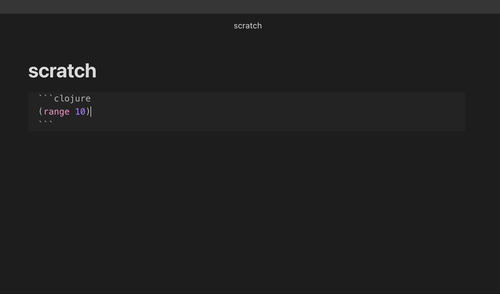
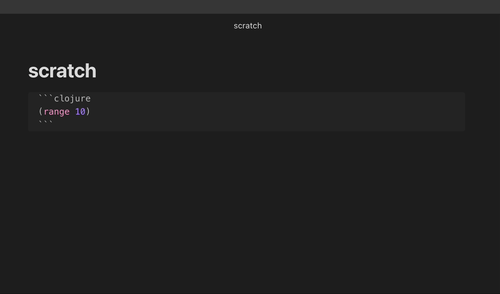

# Obsidian Babashka

Obsidian Babashka is a plugin for [Obsidian](https://obsidian.md/) that lets you run [Clojure](https://clojure.org/) and [ClojureScript](https://clojurescript.org/) code blocks via [Babashka](https://babashka.org/) and [Node Babashka](https://github.com/babashka/nbb) respectively.

The main usecase for this plugin is scripting in the context of your vault documents.

You need to set absolute paths for `bb` (for clojure), and/or `nbb` and `node` (for clojurescript) in the plugin settings before executing code blocks.
You can find these paths using the `where` command in the terminal.


## Features

### Execute codeblock




### Execute codeblock and print outside




### Vault bindings for current file


### Blocking async support in both clj and cljs due to Babashka being awesome


### Supports dependencies via `bb.edn` and `nbb.edn`

You'll find a [`bb.edn`](https://book.babashka.org/#project-setup) and [`nbb.edn`](https://github.com/babashka/nbb#dependencies) in the vault babashka dir.
It defaults to `.babashka`, but configurable in the settings.

You can configure source paths, and add dependencies to these files that will be available in the code blocks.
NPM packages installed in this directory will also be available to CLJS codeblocks.

If you're syncing the vault and installing a lot of dependencies, you might want to set the vault babashka dir to an absolute path outside the vault, so that the dependencies aren't synced.


## How it works

When you call the execute command, the plugin will:
- use a regex to find all code blocks in the file
- if you're not in a clojure or clojurescript block, tell you via a notice, and stop
- otherwise call `bb -e "..."` with your code instead of `...`, with `"` escaped, and with cwd set to the vault babashka dir
- cap the output at 1000 lines if you have that setting turned on
- print the output as comments inside the codeblock, or as just text outside, depending on which execute command you ran
- execution errors and stderr show as notices, and in the developer console

The `vault-bindings` namespace is in `.babashka/gen/vault-bindings.cljc`, and is auto generated each time you execute a code block:

```clojure
(ns vault-bindings)
;; This file is auto-generated by the Babashka plugin when you execute a codeblock.
;; Don't edit it directly, it will be overwritten.
(def *vault-name* "personal")
(def *vault-path* "/Users/filipesilva/Library/Mobile Documents/iCloud~md~obsidian/Documents/personal")
(def *vault-babashka-path* "/Users/filipesilva/Library/Mobile Documents/iCloud~md~obsidian/Documents/personal/.babashka")
(def *last-folder-path* "/Users/filipesilva/Library/Mobile Documents/iCloud~md~obsidian/Documents/personal//")
(def *last-file-name* "scratch.md")
(def *last-file-path* "/Users/filipesilva/Library/Mobile Documents/iCloud~md~obsidian/Documents/personal/scratch.md")
```

## Roadmap

I'd like to add a command to start a REPL, and a command to kill all running processes initiated by the plugin.


## Prior Art

- https://github.com/victorb/obsidian-wielder
- https://github.com/twibiral/obsidian-execute-code


## Development instructions

### How to run the plugin locally

- Clone this repo.
- Either clone into the plugin folder, or symlink it there, e.g. `ln -s /path/to/obsidian-babashka /path/to/your/vault/.obsidian/plugins/obsidian-babashka`.
- `npm i` or `yarn` to install dependencies.
- `npm run dev` to start compilation in watch mode.
- Reload Obsidian to load the plugin initially.
- Disable/Enable the plugin in community plugins to reload it after making changes.

### Releasing new releases

- Update your `manifest.json` with your new version number, such as `1.0.1`, and the minimum Obsidian version required for your latest release.
- Update your `versions.json` file with `"new-plugin-version": "minimum-obsidian-version"` so older versions of Obsidian can download an older version of your plugin that's compatible.
- Create new GitHub release using your new version number as the "Tag version". Use the exact version number, don't include a prefix `v`. See here for an example: https://github.com/obsidianmd/obsidian-sample-plugin/releases
- Upload the files `manifest.json`, `main.js`, `styles.css` as binary attachments. Note: The manifest.json file must be in two places, first the root path of your repository and also in the release.
- Publish the release.

> You can simplify the version bump process by running `npm version patch`, `npm version minor` or `npm version major` after updating `minAppVersion` manually in `manifest.json`.
> The command will bump version in `manifest.json` and `package.json`, and add the entry for the new version to `versions.json`


## Adding your plugin to the community plugin list

- Check https://github.com/obsidianmd/obsidian-releases/blob/master/plugin-review.md
- Publish an initial version.
- Make sure you have a `README.md` file in the root of your repo.
- Make a pull request at https://github.com/obsidianmd/obsidian-releases to add your plugin.


## API Documentation

See https://github.com/obsidianmd/obsidian-api
