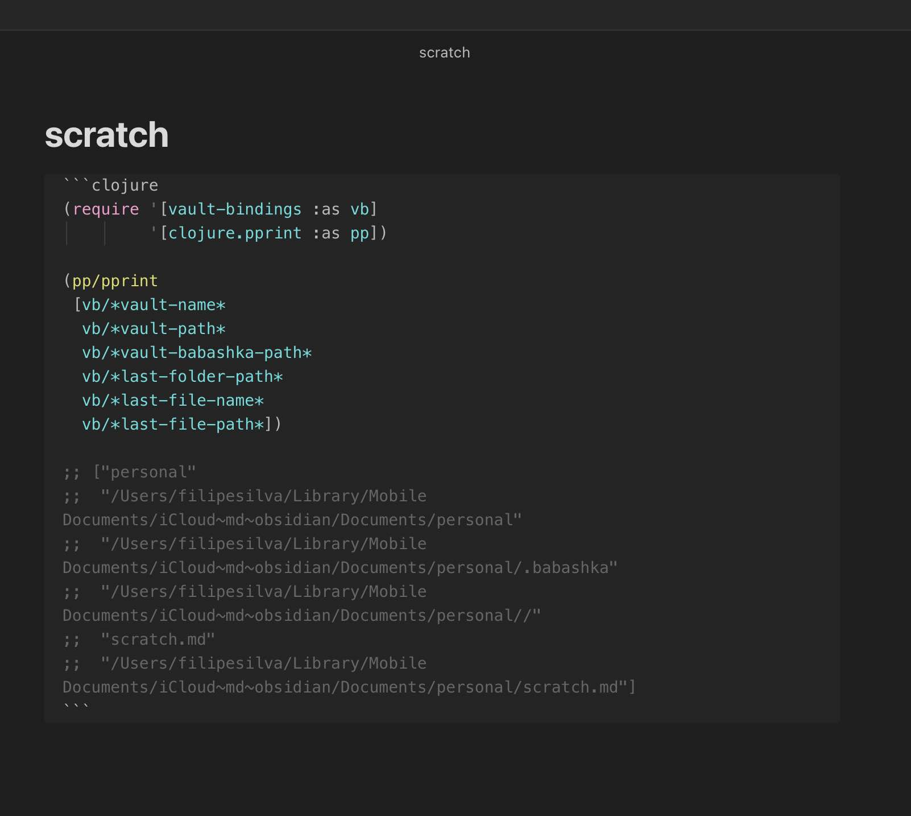

# Obsidian Babashka

Obsidian Babashka is a plugin for [Obsidian](https://obsidian.md/) that lets you run [Clojure](https://clojure.org/) and [ClojureScript](https://clojurescript.org/) code blocks via [Babashka](https://babashka.org/) and [Node Babashka](https://github.com/babashka/nbb) respectively.

The main usecase for this plugin is scripting in the context of your vault documents.


## Pre-requisites

You'll need to have [Babashka](https://github.com/babashka/babashka#installation) installed for `clojure` codeblocks, and/or [Node](https://nodejs.org/en/download/) and [Node Babashka](https://github.com/babashka/nbb#usage) installed for `clojurescript` codeblocks.

You need to set absolute paths for `bb` (for clojure), and/or `node` and `nbb` (for clojurescript) in the plugin settings before evaluating code blocks.
You can find these paths using the `where` command in the terminal.

If you come from a Clojure background but are not familiar with Babashka, keep in mind that Babashka has differences from Clojure, and also has included libraries that are not in Clojure.
Take a look at the Babashka and Node Babashka docs to learn more about what's available.


## Features

### Eval clojure and clojurescript codeblocks


### Eval codeblock and print value outside


### Start and connect to a Babashka nREPL server


### Vault bindings for current file



Here's the code if you want to copy paste:
```clojure
(require '[vault-bindings :as vb])

[vb/*vault-name*
 vb/*vault-path*
 vb/*vault-babashka-path*
 vb/*last-folder-path*
 vb/*last-file-name*
 vb/*last-file-path*
 vb/*vault-plugin-folder*]
```


### Blocking async support in both clj and cljs due to Babashka being awesome


### Kill all eval and nREPL processes

Use `Babashka: Kill all Babashka processes` to kill all eval and nREPL processes and their clients.


### Dependencies via `bb.edn` and `nbb.edn`

You'll find a [`bb.edn`](https://book.babashka.org/#project-setup) and [`nbb.edn`](https://github.com/babashka/nbb#dependencies) in the vault babashka dir.
It defaults to `.babashka`, but configurable in the settings.

You can configure source paths, and add dependencies to these files that will be available in the code blocks.
NPM packages installed in this directory will also be available to CLJS codeblocks.

If you're syncing the vault and installing a lot of dependencies, you might want to set the vault babashka dir to an absolute path outside the vault, so that the dependencies aren't synced.


## How it works

When you call the eval command, the plugin will:
- use a regex to find all code blocks in the file
- if you're not in a clojure or clojurescript block, tell you via a notice, and stop
- send your code to REPL, if any, or call `bb -e "..."` with your code instead of `...`, with `"` escaped, and with cwd set to the vault babashka dir
- cap the output at 1000 lines if you have that setting turned on
- print the output as comments inside the codeblock, or as just text outside, depending on which eval command you ran, and in the developer console (cmd+opt+i in mac, just like chrome)
- eval errors and stderr show as notices, and in the developer console

Messages are printed to the developer console as debug level, so you will need to turn on the verbose log level in the developer console settings to see them.
They are also prefixed with `[obsidian-babashka]` so you can filter them out.

When you call the repl command, the plugin will:
- spawn a new Babashka nREPL server process on the settings port
- wait until it sees the string `nREPL`
- connect to the nREPL client
- show a notice that connection was successful
- show on the status bar which clients are active
- setup handlers to remove the process and client on errors or close
- kill all processes when the plugin is unloaded

When you call the kill processes command, the plugin will:
- show a notice of how many it's killing
- send a kill call to all eval and nREPL processes
- disconnect and destroy all nREPL clients

The `vault-bindings` namespace is in `.babashka/gen/vault-bindings.cljc`, and is auto generated each time you eval a code block:

```clojure
(ns vault-bindings)
;; This file is auto-generated by the Babashka plugin when you eval a codeblock.
;; Don't edit it directly, it will be overwritten.
(def *vault-name* "personal")
(def *vault-path* "/Users/filipesilva/Library/Mobile Documents/iCloud~md~obsidian/Documents/personal")
(def *vault-babashka-path* "/Users/filipesilva/Library/Mobile Documents/iCloud~md~obsidian/Documents/personal/.babashka")
(def *last-folder-path* "/Users/filipesilva/Library/Mobile Documents/iCloud~md~obsidian/Documents/personal//")
(def *last-file-name* "scratch.md")
(def *last-file-path* "/Users/filipesilva/Library/Mobile Documents/iCloud~md~obsidian/Documents/personal/scratch.md")
```

## Roadmap

I'd like to save a couple of codeblocks to use with shortcuts. 
This way you could run that code over a different context, and even use text selection as an input.
I imagine text selection would be added to *vault-bindings*.

Starting an in-process nbb repl with access to the editor command bindings sounds interesting.
It might help with debugging, and also with writing code that interacts with the editor.
But it might also be a bad idea, since it could only be force killed by killing the editor process.

## Prior Art

- https://github.com/victorb/obsidian-wielder
- https://github.com/twibiral/obsidian-execute-code


## Development instructions

### How to run the plugin locally

- Clone this repo.
- Either clone into the plugin folder, or symlink it there, e.g. `ln -s /path/to/obsidian-babashka /path/to/your/vault/.obsidian/plugins/obsidian-babashka`.
- `npm i` or `yarn` to install dependencies.
- `npm run dev` to start compilation in watch mode.
- Reload Obsidian to load the plugin initially.
- Disable/Enable the plugin in community plugins to reload it after making changes.

### Releasing new releases

- Update your `manifest.json` with the minimum Obsidian version required for your latest release.
- Run `yarn version` and input the new version number
- Create new GitHub release using your new version number as the "Tag version". Use the exact version number in the release name, don't include a prefix `v`. See here for an example: https://github.com/obsidianmd/obsidian-sample-plugin/releases
- Upload the files `manifest.json`, `main.js`, `styles.css` as binary attachments. Note: The manifest.json file must be in two places, first the root path of your repository and also in the release.
- Publish the release.

## Adding your plugin to the community plugin list

- Check https://github.com/obsidianmd/obsidian-releases/blob/master/plugin-review.md
- Publish an initial version.
- Make sure you have a `README.md` file in the root of your repo.
- Make a pull request at https://github.com/obsidianmd/obsidian-releases to add your plugin.


## API Documentation

See https://github.com/obsidianmd/obsidian-api
